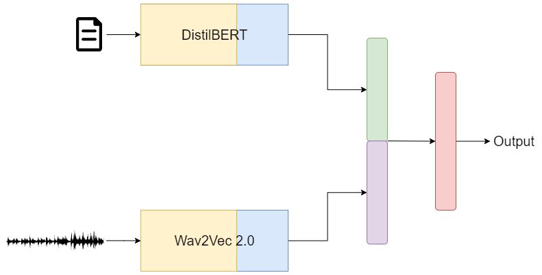
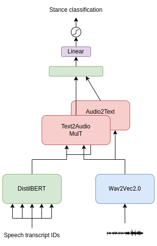
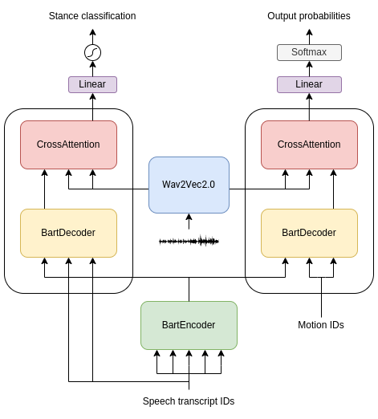
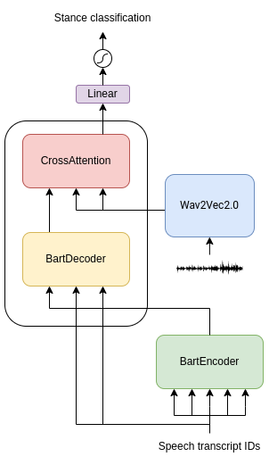

<br />
<p align="center">
    
  </a>
  <h3 align="center">Implicit Stance Prediction on Political Debates using Speech Features</h3>
  <p align="center">
    <br />
    <a href="docs/report.pdf"><strong>Explore the docs »</strong></a>
    <br />
    <br />
  </p>
</p>


## About The Project
Stance Prediction is the task of classifying the stance of a particular argument expressed by a speaker, towards a certain target (motion). In this project we address the problem where only two types of stances are available (pro or against) without considering the motion explicitly, but trying to infer it from the speech.
This work is focused on the [IBMDebater "Debate Speech Analysis"](https://aclanthology.org/2020.acl-main.633/), it provides both speeches and their transcriptions labeled with the motion and their stance.

The main focus of this project is to try to see if using spoken features together with text could lead to an improvement in performance in detecting stances.

We address the Stance Prediction task by developing three kinds of models:
* **Text Model**: tries to predict the stances of the speech transcriptions. Its core is [DistilBERT](https://arxiv.org/abs/1910.01108)
* **Audio Model**: tries to predict the stances of the speeches. Its core is [wav2vec 2.0](https://arxiv.org/abs/2006.11477)
* **Multimodal Model**: tries to predict the stances using both speeches and their transcriptions. Combines both the aforementioned models.



Each model features a pre-trained architecture with a classification head attached at the end of it. Each model is then fine-tuned by freezing the weights of the pre-trained model up to a certain layer and training the remaining part, including the classification head.

The evaluation metric is accuracy. The evaluations on the test set showed that the best Text Model achieved 93.82%, the best Audio Model achieved 92.04% accuracy while the best Multimodal Model achieved a **94.65%** accuracy, showing a little improvement in using both audio and text signals.

## Extension
We wanted to investigate if audio features can be useful to predict the stance of political speeches without knowing the motion in advance. To investigate this new task we developed three different architectures:


<table width=100%> 
<tr> <td width=50%>
<b>MulT-based model</b>: combines <a href="https://arxiv.org/abs/1910.01108"> DistilBERT </a> and <a href="https://arxiv.org/abs/2006.11477"> wav2vec 2.0 </a>outputs with a series of <a href="https://github.com/yaohungt/Multimodal-Transformer"> MulT </a></td> 

<td align="center"></td>
</tr> 
<tr> 
<td> <b>BART for motion generation and stance classification</b>: predict the motion together with the stance of the speech by encoding the text using a <a href="https://arxiv.org/abs/1910.13461"> BART </a> encoder and two different BART decoders to extract features for the generative and the sequence classification task respectively. Using a series of crossmodal attentions, the extracted audio features are then combined with both generative and classification decoders.</td> 

<td align="center"> </td> 
</tr> 


<tr> <td> <b>BART for stance classification</b>: uses <a href="https://arxiv.org/abs/1910.13461"> BART </a>  textual signal and combines the outputs of its decoder with those of <a href="https://arxiv.org/abs/2006.11477"> wav2vec 2.0 </a>with a series of crossmodal attentions</td> 

<td align="center"> </td>
</tr></table>


## Requirements
The code requires python >= 2.7 as well as the libraries listed in requirements.txt:

**Install Modules:** 

```sh
  pip install -U pip
  pip install -r requirements.txt
  ```

## Authors

| Name              | Email                            | Username                                        |
|-------------------|----------------------------------|-------------------------------------------------|
| Lorenzo Pratesi   | lorenzo.pratesi2@studio.unibo.it | [_Prahtz_](https://github.com/Prahtz)           |
| Martina Rossini   | martina.rossini3@studio.unibo.it | [_mwritescode_](https://github.com/mwritescode) |
| Riccardo Foschi   | riccardo.foschi4@studio.unibo.it | [_snifus_](https://github.com/snifus)           |
| Vairo Di Pasquale | vairo.dipasquale@studio.unibo.it | [_vairodp_](https://github.com/vairodp)         |
